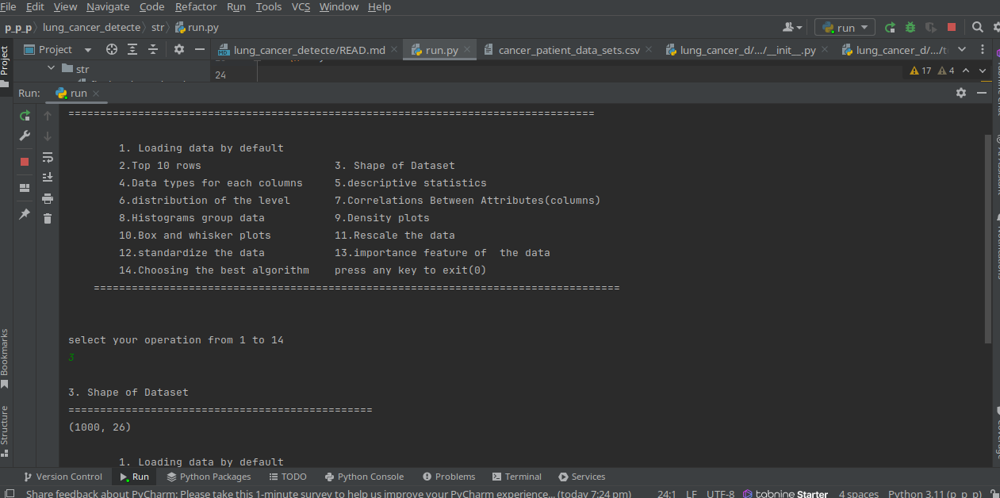

Project Name This is lung_cancer_detection

Project Status: Running Project objective 
Data Science lung cancer detection  
Technologies :pandas numpy matplotlib sklearn


<h1 align="center">lung_cancer_detection</h1>

---

<h3 align="center">Problem Statement</h3>

Explain the problem statement

---

<h3 align="center">Solution Explaination</h3>

Click the below image to see vedio solution explaination 


---

<h3 align="center">Approch for the problem</h3>

Explain the problem solving approch

---

<h3 align="center">Project UI</h3>

<p align="center"></p>

---


<h3 align="center">Project Structure</h3>

```
                       

│  
├── data        <-- contains the dataset and  images used in the project and readme file
│   │
│   ├── cancer_patient_data_sets.csv
│   └── image.png
│   
├── str
│   │
│   ├──lung_cancer_d
│   │   │
│   │   ├── utilities
│   │   │   │
│   │   │   ├── __init.py             
│   │   │   │                                        
│   │   │   └── tools.py        
│   │   │   
│   │   └── __init__.py
│   │
│   └── run.py
├── README.md                                <-- used to display the information about the project
│
│
└── requirements.txt                         <-- text file which contain the dependencies/packages used in project 
                            


Acknowledgements:

This data comes from https://data.world/cancerdatahp/lung-cancer-data
